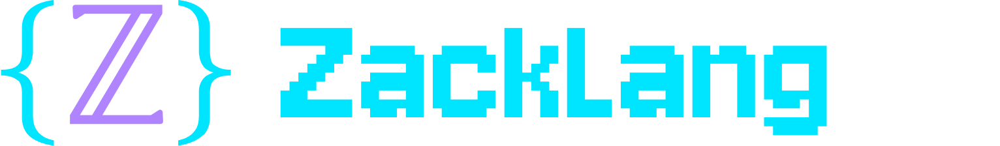

# ZackLang Compiler

A modern, optimizing compiler infrastructure designed for performance and reliability.

## Overview

Zacklang is a robust compiler infrastructure that implements advanced optimization techniques and generates efficient LLVM IR. It features a modular design with a focus on extensibility and maintainability.

## Features

- **Advanced Optimization Pipeline**

  - [x] Dead Block Elimination
  - [x] Block Merging
  - [x] Jump Threading
  - [x] Critical Edge Detection and Splitting
  - [ ] Value Numbering (Planned)

- **Robust IR System**

  - Type-safe intermediate representation
  - SSA form
  - Comprehensive control flow analysis

- **Performance-Focused Design**
  - Efficient memory management
  - Fast optimization passes
  - Scalable to large codebases

## Performance Benchmarks

Recent benchmarks demonstrate the efficiency of our optimization passes:

### Dead Block Elimination Performance

```
Structure Time (μs) Blocks
Linear 991.39 100,000
Tree 1005.36 100,000
```

### Block Merging Performance

```
Structure    Size    Merge Check (μs)    Merge Time (μs)    Total (μs)
Linear Chain 10      1                   33                 34
Linear Chain 50      3                   90                 93
Linear Chain 100     6                   120                126
Diamond      20      8                   65                 73
Diamond      40      15                  110                125
```

### Jump Threading Performance

```
Structure       Size    Find Time (μs)    Thread Time (μs)   Total (μs)
Linear Chain    10      1865              1865               1865
Linear Chain    100     57052             57052              57052
Linear Chain    1000    302370            302370             302370
Complex Pattern 10      30152             30152              30152
Complex Pattern 100     66642             66642              66642
C API           10      311               311                311
C API           100     2430              2430               2430
C API           500     168051            168051             168051
```

Key findings:

- Dead Block Elimination: Processes 100K blocks in ~1ms
- Block Merging:
  - Scales linearly with graph size
  - Efficient merge checks (< 10μs for most cases)
  - C API implementation performs on par with native C++
  - Handles complex control flow structures efficiently
- Jump Threading:
  - Performance scales with the number of blocks and complexity of the control flow
  - C API implementation is generally faster than the C++ implementation for smaller graphs
  - Linear chains show predictable scaling, while complex patterns require more processing

## Building

```bash
# Clone the repository
git clone https://github.com/yourusername/zacklang.git
cd zacklang

# Build the project
make

# Run tests
make test
```

## Requirements

- C++17 compatible compiler
- LLVM 15.0 or later
- CMake 3.15 or later

## Project Structure

```
zacklang/
├── include/         # Public headers
├── src/            # Implementation files
├── tests/          # Test suite
│   ├── ast/        # AST tests
│   ├── zir/        # ZIR tests
│   └── benchmarks/ # Performance tests
└── docs/           # Documentation
```

## Contributing

We welcome contributions! Please see our [Contributing Guidelines](CONTRIBUTING.md) for details.

## Optimization Passes

### 1. Dead Block Elimination [x]

- Identifies and removes unreachable blocks
- Maintains control flow graph integrity
- Handles complex nested structures
- Benchmark-proven performance

### 2. Block Merging [x]

- Identifies and combines adjacent blocks with safe control flow
- Performs comprehensive safety checks before merging
- Preserves semantic equivalence of the program
- Optimizes instruction layout for better performance
- Reduces branch overhead in generated code
- C API support for integration with external tools
- Thoroughly tested with a variety of control flow patterns

### 3. Jump Threading (Analysis Phase) [x]

- Identifies redundant jumps that can be bypassed
- Analyzes blocks that only contain jumps to determine if they can be eliminated
- Validates safety of jump threading transformations
- Detects opportunities for control flow optimization
- Prevents unsafe transformations in the presence of PHI nodes
- Thoroughly tested with various control flow patterns

### 4. Critical Edge Detection and Splitting [x]

- Identifies critical edges in the control flow graph (edges from blocks with multiple successors to blocks with multiple predecessors)
- Validates which critical edges are safe to split
- Implements transformation to split critical edges by inserting new blocks
- Preserves control flow semantics when splitting edges
- Ensures phi nodes and other instructions are properly handled
- Provides comprehensive C API support for edge detection, validation and splitting
- Properly handles error conditions and edge cases
- Robust test suite covering various control flow patterns and transformations

## License

This project is licensed under the MIT License - see the [LICENSE](LICENSE) file for details.

## Acknowledgments

Special thanks to all contributors and the LLVM community for their invaluable work and inspiration.

---

_Zacklang - Building the future of compilation, one optimization at a time._
